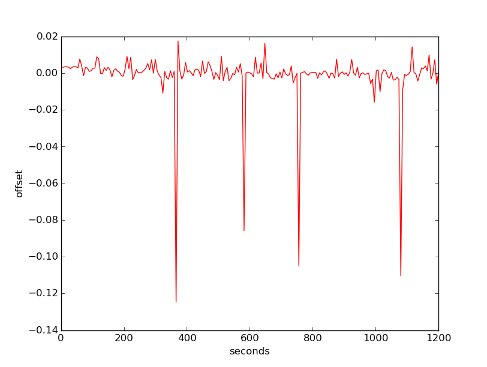

# Consulta-ntp
**Exercício da disciplina Sistemas distribuídos:** Como atividade individual para o sábado letivo, codifique um script que realize uma
consulta NTP a cada seis segundos, durante uma hora, e ao final gere um gráfico mostrando a variação do offset de resposta. Faça uma análise crítica do gráfico, explicando o comportamento do mesmo. 

**Resposta:** Após o algoritmo ser executado durante uma hora(60 minutos) e realizando consultas a cada seis segundos, notou-se que em grande parte do tempo o relógio do cliente estava sempre adiantado. O maior pico ocorreu perto dos 8(480 segundos) minutos, o cliente chegou a marcar – 0,17 unidades de tempo(adiantado). O relógio do cliente ficou cerca de 11 minutos adiantando entre os minutos 28,3(1700 segundos) e 39,3(2358 segundos), sendo a maior constante em relação de adiantamento do cliente e o servidor. No minuto 41(2460 segundos) ocorreu a maior queda, isto é, Maior diferença de uma consulta para outra, a queda foi de – 0,15 unidades de tempo(adiantado). Entre os minutos 51(3060 segundos) e 58,3(3500) ocorreu a maior alternância entre sincronizado e adiantado – hora o cliente estava sincronizado, hora adiantado. Também houve momentos em que o cliente estava atrasado em relação ao servidor – poucos momentos que isso ocorreu - , isso ocorreu por volta do minuto 59(3550) e permaneceu até o fim da execução do algoritmo, isto implica que o cliente no fim terminou atrasado em relação ao servidor cerca de 0,7 unidades de tempo(atrasado). Vale ressaltar que durante a execução do algoritmo, o computador estava sendo utilizado para navegar na internet por terceiros, e de acordo com site <http://ntp.br/ntp.php>: “Há atrasos estocásticos nas redes devido às filas dos roteadores e switchs. ”. Abaixo se encontra o gráfico gerado pelo algoritmo.

Para curiosidade, foi feita uma segunda execução de apenas 20 minutos. Nessa execução não houve qualquer tipo de interferência de terceiros, isto é, o computador do cliente ficou apenas executando o algoritmo. Considerando apenas os 20 primeiros minutos de ambos, notou-se que na segunda execução houve um tempo maior de sincronização entre o cliente e o servidor. Veja na figura abaixo o gráfico da segunda execução.

Depois de analisar os dois gráficos, cheguei a uma pequena conclusão de que o uso da internet durante a primeira execução interferiu na sincronização. Obs.: O computador do cliente utiliza a internet via rádio.
